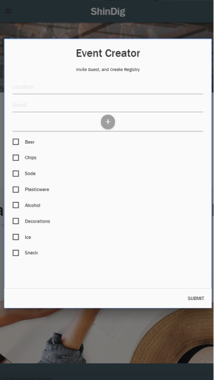
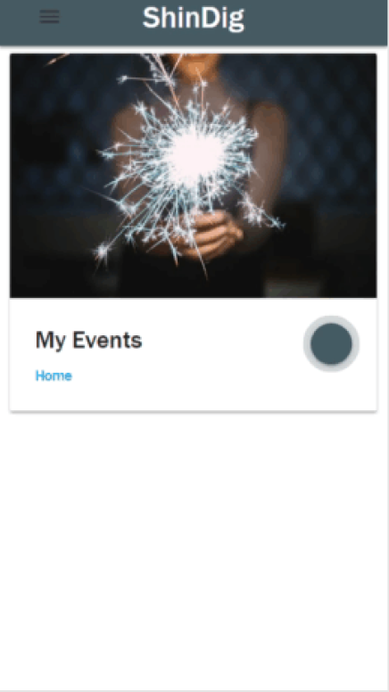

## Why  Shindig: 
The goal of ShinDig is to empower individuals to create, plan, and execute any event type, at any size. ShinDig will become the only applicaiton needed for both host and guest to assign tasks, save event infomraiton, and invite friends and family. 

## MVP:
#### PHASE ONE:
- Create viable react app and github repo that has a working Heroku Pipeline,
- Create wireframe and application models using Figma, 
- Create and organize Github Project in project repository. 

#### PHASE TWO: 
- Create authentication page using Auth0 technology, 
- Connect Google Maps, Google Calander, and Amazon APIs, 
- Integrate React technologies with current project2 code,
- Working integrated messenging service. 

#### PHASE THREE: 
- Functionality testing, 
- Polishing UI, 
- Checking validations, debugging, and ensuring code is Restful. 

#### PHASE FOUR: 
- Presentation preparation, 
- Update and Deploy Readme.md 

## GOALS
As a group we decided to continue from our project 2 application and introduce new technologies and libraries. Our project 2 app did not meet MVP and to correct that our goals are as follows: 
- create and follow a viable github project page. Use colorcoding and card labeling to keep track of MVP, wish, and future development items. 
- create seperate heroku pipelines to individual github repos so that each person can test without having to push to master branch. 
- Working builtin messenger,
- Operational react deployment, 
- Complete project 2 so it is a viable product by: 
    - have google and amazon api working, 
    - authentication page (go with Auth0 instrad of firebase technologies),

## TECH 
- Node.js
- React 
- Heroku
- Express 
- MongoDB 
- Bootstrap / React Bootstrap
- Auth0
- Figma
- GitHub Project (project manager) 
- Google Maps, Google Calander, and Amazon search APIs 

## WIREFRAME
,
,
,
,

## LEARNING OBJ. PER TEAM MEMBER
### Amanda Padilla (Full Stack Developer)

- Personal Goal: Be able to understand and deploy react successfully and master authenication. "Git Good"

### Javier Vega (Full Stack Developer)

- Personal Goal: Understanding components and multipage applications in React. 

### Michael Wenhold (Full Stack Developer)

- Personal Goal: Master Authenication, API connections, and React technologies. 

### Kang Park (Full Stack Developer)

- Personal Goal: Master React deployment, MongoDB, API connections, and continued study Javascript in general. 

### Stephanie Gonzales (Full Stack Developer)

- Personal Goal: Understand each file within the application and understand the connections and organization systems within React that connect front end and back end work. Improve CSS skills and MongoDB technologies. 

## HEROKU PIPELINE 
- Create a master pipeline names ShinDig2_0 that has automatic deploys to the Github master branch. 
- Create individual pipelines for connect to individual github branches within the Project3 Repo. 

## GITHUB Project
- As a ground we decided to use Github Project as our project management system. We have used this system in the past however we did not utilize all of the possible tools. 

This project was bootstrapped with [Create React App](https://github.com/facebook/create-react-app).

## Available Scripts

In the project directory, you can run:

### `npm start`

Runs the app in the development mode. 
Open [http://localhost:3000](http://localhost:3000) to view it in the browser.

The page will reload if you make edits. 
You will also see any lint errors in the console.

### `npm test`

Launches the test runner in the interactive watch mode. 
See the section about [running tests](https://facebook.github.io/create-react-app/docs/running-tests) for more information.

### `npm run build`

Builds the app for production to the `build` folder. 
It correctly bundles React in production mode and optimizes the build for the best performance.

The build is minified and the filenames include the hashes. 
Your app is ready to be deployed!

See the section about [deployment](https://facebook.github.io/create-react-app/docs/deployment) for more information.

### `npm run eject`

**Note: this is a one-way operation. Once you `eject`, you can’t go back!**

If you aren’t satisfied with the build tool and configuration choices, you can `eject` at any time. This command will remove the single build dependency from your project.

Instead, it will copy all the configuration files and the transitive dependencies (Webpack, Babel, ESLint, etc) right into your project so you have full control over them. All of the commands except `eject` will still work, but they will point to the copied scripts so you can tweak them. At this point you’re on your own.

You don’t have to ever use `eject`. The curated feature set is suitable for small and middle deployments, and you shouldn’t feel obligated to use this feature. However we understand that this tool wouldn’t be useful if you couldn’t customize it when you are ready for it.

## Learn More

You can learn more in the [Create React App documentation](https://facebook.github.io/create-react-app/docs/getting-started).

To learn React, check out the [React documentation](https://reactjs.org/).

